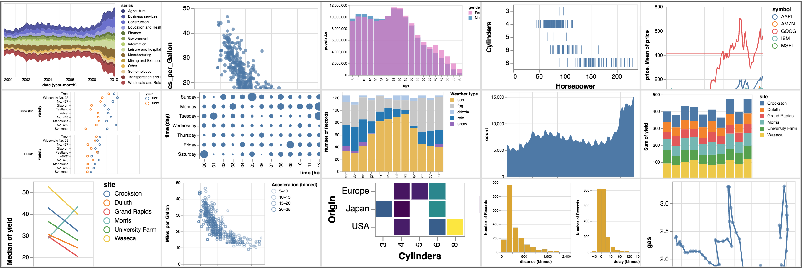

# Vega-Lite

    

[Vega-Lite](https://vega.github.io/vega-lite/) provides a higher-level grammar for visual analysis that generates complete [Vega](https://vega.github.io/) specifications.

You can find more details, [documentation](https://vega.github.io/vega-lite/docs/), [examples](https://vega.github.io/vega-lite/examples/), [usage instructions](https://vega.github.io/vega-lite/usage/embed.html), and [tutorials](https://vega.github.io/vega-lite/tutorials/getting_started.html) on the [Vega-Lite website](https://vega.github.io/vega-lite/).

Try using Vega-Lite in the online [Vega Editor](https://vega.github.io/editor/#/custom/vega-lite).

Contributions are also welcome. Please see [CONTRIBUTING.md](CONTRIBUTING.md) for contribution and development guidelines and our [Code of Conduct](https://vega.github.io/vega/about/code-of-conduct/).

Read about future plans in [our roadmap](https://docs.google.com/document/d/1fscSxSJtfkd1m027r1ONCc7O8RdZp1oGABwca2pgV_E).

## Team

The development of Vega-Lite is led by the alumni and members of the [University of Washington Interactive Data Lab](https://idl.cs.washington.edu) (UW IDL), including [Kanit "Ham" Wongsuphasawat](https://twitter.com/kanitw) (now at Apple), [Dominik Moritz](https://twitter.com/domoritz) (UW IDL), [Arvind Satyanarayan](https://twitter.com/arvindsatya1) (now at MIT), and [Jeffrey Heer](https://twitter.com/jeffrey_heer) (UW IDL).

Vega-Lite gets significant contributions from its community. In particular [Will Strimling](https://willium.com), [Yuhan (Zoe) Lu](https://github.com/YuhanLu), [Souvik Sen](https://github.com/invokesus), [Chanwut Kittivorawong](https://github.com/chanwutk), [Matthew Chun](http://mattwchun.com/), [Akshat Shrivastava](https://github.com/AkshatSh), [Saba Noorassa](https://github.com/Saba9), and [Sira Horradarn](https://github.com/sirahd). Please see the [contributors page](https://github.com/vega/vega-lite/graphs/contributors) for the full list of contributors.
