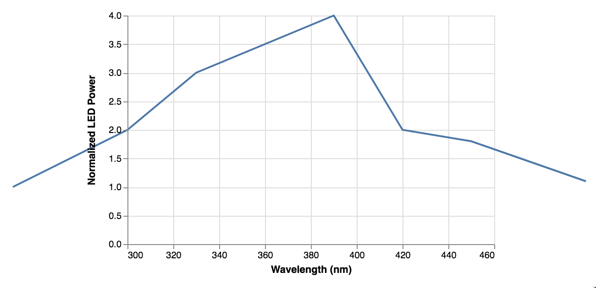
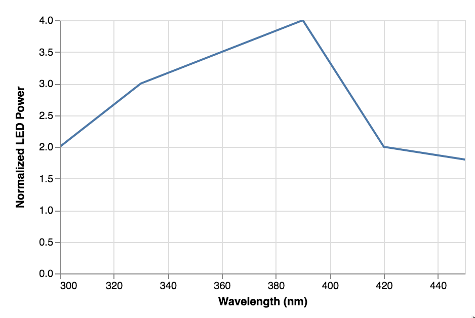

(Note: this should be inserted at the end of the `Scale Domains` section in `scale.md`.)

A common use case for the `domain` property is to limit, for example, the `x` range of values to include in a plot. However, setting the domain property alone is insufficient to achieve the desired effect. For example, consider the line plot specification below in which the `x` domain is restricted to the range `[300, 450]`.

    {
      "$schema": "https://vega.github.io/schema/vega-lite/v2.json",
      "data": {
        "values": [
          {"wavelength": 250, "normalized_power": 1},
          {"wavelength": 300, "normalized_power": 2},
          {"wavelength": 330, "normalized_power": 3},
          {"wavelength": 390, "normalized_power": 4},
          {"wavelength": 420, "normalized_power": 2},
          {"wavelength": 450, "normalized_power": 1.8},
          {"wavelength": 500, "normalized_power": 1.1}
        ]
      },
      "encoding": {
        "x": {
          "axis": {
            "title": "Wavelength (nm)"
          },
          "field": "wavelength",
          "scale": {
            "domain": [
              300,
              450
            ]
          },
          "type": "quantitative"
        },
        "y": {
          "axis": {
            "orient": "left",
            "title": "Normalized LED Power"
          },
          "field": "normalized_power",
          "type": "quantitative"
        }
      },
      "height": 250,
      "mark": "line",
      "width": 400
    }

This results in the following plot.

 

There are two approaches to keep the line from being plotted outside the desired `x` range of values. The first is to use clipping, which is done by replacing

    "mark": "line",

with 

    "mark": {
        "type": "line",
        "clip": true,
    },

resulting in

The second approach is to use a `transform` as shown below, which results in the same plot as above.

    {
      "$schema": "https://vega.github.io/schema/vega-lite/v2.json",
      "data": {
        "values": [
          {"wavelength": 250, "normalized_power": 1},
          {"wavelength": 300, "normalized_power": 2},
          {"wavelength": 330, "normalized_power": 3},
          {"wavelength": 390, "normalized_power": 4},
          {"wavelength": 420, "normalized_power": 2},
          {"wavelength": 450, "normalized_power": 1.8},
          {"wavelength": 500, "normalized_power": 1.1}
        ]
      },
      "transform": [{
        "filter": {"field": "wavelength", "range": [300, 450]}
      }],
      "encoding": {
        "x": {
          "axis": {
            "title": "Wavelength (nm)"
          },
          "field": "wavelength",
          "scale": {
            "domain": [
              300,
              450
            ]
          },
          "type": "quantitative"
        },
        "y": {
          "axis": {
            "orient": "left",
            "title": "Normalized LED Power"
          },
          "field": "normalized_power",
          "type": "quantitative"
        }
      },
      "height": 250,
      "mark": "line",
      "width": 400
    }

